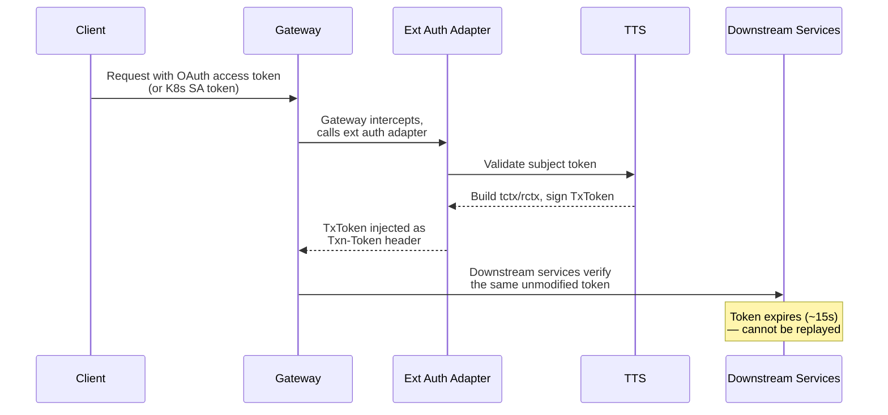
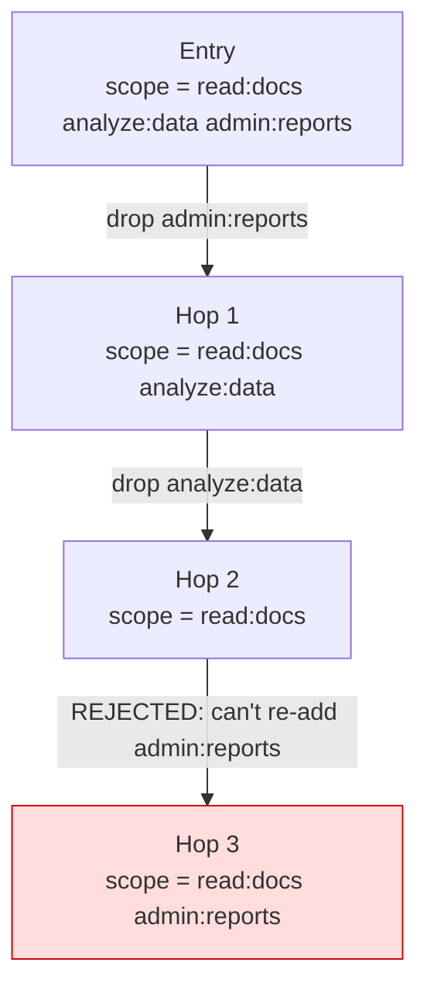

# Concepts

This page explains the core concepts behind kontxt and Transaction Tokens. For a quick overview, see [README.md](../README.md). For the full design rationale, see [proposal.md](proposal.md).

---

## Token Lifecycle

A TxToken's life follows this path:



Key property: the TxToken is created **once** at the entry point and propagated **unmodified** through the entire call chain. Each downstream service verifies it independently. No service needs to call the TTS again (unless scope narrowing is requested).

---

## Transaction Context (`tctx`) vs Requester Context (`rctx`)

TxTokens carry two distinct context objects. Understanding the difference is critical for designing effective authorization.

### `tctx` — Transaction Context

**Purpose:** Fine-grained authorization details — *what* is being authorized.

The `tctx` claim contains request-specific parameters that downstream services use for authorization decisions. It's populated from two sources:

1. **Extracted from the request** — The ext auth adapter extracts fields from the request path, body, headers, or query parameters based on `TransactionType` CRD configuration.
2. **Computed by the TTS** — The TTS can enrich `tctx` with values not present in the original request (e.g., looking up a dataset's classification, a user's tier, or a resource's sensitivity level).

```json
"tctx": {
  "purpose": "earnings-analysis",
  "company": "ACME",
  "period": "Q3-2024",
  "classification": "public",     // ← computed by TTS, not in original request
  "customer_tier": "enterprise"   // ← computed by TTS
}
```

**Why it matters for agents:** Without `tctx`, a downstream service only knows "user X has scope `read:docs`." With `tctx`, it knows "user X is analyzing ACME's Q3-2024 earnings (classified public) via the research agent." That's the difference between coarse RBAC and fine-grained, request-specific authorization — sealed cryptographically at the entry point, so downstream services don't each need to re-derive it.

### `rctx` — Requester Context

**Purpose:** Environmental metadata — *how* the request arrived.

The `rctx` claim captures contextual information about the request environment, typically passed through from the entry point without computation.

```json
"rctx": {
  "req_ip": "10.0.0.42",
  "authn": "oidc"
}
```

Used for supplementary purposes: IP-based restrictions, audit logging, compliance checks.

### Comparison

| | `tctx` (Transaction Context) | `rctx` (Requester Context) |
|---|---|---|
| Populated from | `request_details` + TTS computation | `request_context` param |
| Purpose | Fine-grained authorization | Environmental metadata |
| Used for authz? | **Yes** — primary authorization details | Supplementary (IP restrictions, audit) |
| TTS can enrich? | **Yes** — compute values not in original request | Typically pass-through |
| Immutable? | Yes | Yes |
| Agent example | `{"tool":"csv-analyzer","dataset":"ds-1234"}` | `{"req_ip":"10.0.0.42","authn":"oidc"}` |

---

## Persona Ownership Model

kontxt uses four CRDs, each aligned to a distinct persona. This factoring isn't arbitrary — it solves a fundamental multi-tenant authorization problem.

### The problem

When Agent A in `team-alpha` calls `storage-service` in `team-beta`, **who defines what the TxToken should look like?**

Neither team owns the full picture:
- **Team Alpha** knows *what* the transaction is (purpose, parameters to extract)
- **Team Beta** knows *what* their service expects (required `tctx` fields, minimum scope)
- **Platform Admin** set up the IdPs and TTS
- **Security Admin** constrains all of it

A single CRD owned by one team can't represent both sides. If everything lived in one resource:
- Either Team Alpha needs write access to Team Beta's namespace → **RBAC violation**
- Or the resource contains assumptions about Team Beta's services that Team Beta never agreed to → **contract violation**

### The four personas

```
Cluster
├── kontxt-system (Platform Admin)
│   └── TTS, Controller, Ext Auth Adapter
│
├── team-alpha (Transaction Owner)           team-beta (Service Owner)
│   ├── TransactionType:                     ├── ServiceTokenRequirement:
│   │   "When my agent calls                 │   "My service requires
│   │    POST /api/research,                 │    scope read:docs and
│   │    extract company from body,          │    tctx field company"
│   │    purpose = earnings-analysis"        │
│   └── agent-orchestrator (pod)             └── document-retriever (pod)
│
└── (Security Admin — cluster-wide)
    └── TokenPolicy:
        "Max lifetime 30s,
         purpose is mandatory in tctx"
```

| Persona | CRD | Scope | What they configure |
|---------|-----|-------|-------------------|
| **Platform Admin** | `TxTokenConfig` | Cluster | Trust domain, issuer, pluggable IdP authenticators, workload auth mechanism, token defaults |
| **Transaction Owner** | `TransactionType` | Namespace | Endpoint → TxToken mapping: purpose, scope, `tctx` field extraction from request, enrichments |
| **Service Owner** | `ServiceTokenRequirement` | Namespace | Verification requirements: required scope, required `tctx` fields, CEL rules, excluded endpoints, auto-narrowing |
| **Security Admin** | `TokenPolicy` | Cluster | Guardrails: authorized namespaces, scope ceilings, mandatory fields, max lifetime, CEL issuance rules |

Each persona operates within their RBAC boundary. Namespace-scoped CRDs (`TransactionType`, `ServiceTokenRequirement`) use standard Kubernetes RBAC — a developer can create resources in their own namespace without elevated permissions.

---

## Scope Narrowing

TxToken scope can only **shrink** through the call chain — never expand. This is a fundamental security property.

### How it works

1. At the entry point, the TxToken is issued with the requested scope (which must be ≤ the subject token's scope).
2. An intermediate service that needs fewer permissions can request a **replacement token** with narrower scope. The TTS issues a new TxToken with:
   - The **same** `txn` (transaction ID preserved for audit)
   - A **subset** of the original scope
   - The same `tctx` and `rctx` (immutable)
3. The TTS rejects any attempt to expand scope beyond what the original token had.



### Auto-narrowing

The `ServiceTokenRequirement` CRD supports an `autoNarrow` flag. When enabled, the ext auth adapter automatically requests a scope-narrowed replacement token when the inbound TxToken has broader scope than the service requires. This happens transparently at the gateway — no code changes in the service.

---

## AgentGateway Integration

kontxt integrates with AgentGateway through the standard **Envoy ext_authz v3 gRPC protocol**, making it portable across any Envoy-compatible proxy.

### Two modes

The ext auth adapter runs in two modes, typically as separate deployments:

**Generation mode** (entry points):
1. AgentGateway intercepts an incoming request on a matching route
2. Sends an `ext_authz Check()` RPC to the generation ext auth adapter
3. The adapter extracts the OAuth access token from the `Authorization` header
4. Calls the TTS to exchange it for a TxToken (RFC 8693 token exchange)
5. Returns OK with a `Txn-Token` header injected into the request
6. AgentGateway forwards the request to the backend with the TxToken

**Verification mode** (downstream services):
1. AgentGateway intercepts a request to a downstream service
2. Sends an `ext_authz Check()` RPC to the verification ext auth adapter
3. The adapter extracts the `Txn-Token` header
4. Verifies the JWT signature, expiration, audience, and checks verification rules (required scope, required `tctx` fields, CEL rules)
5. Returns OK if valid, or denied (401/403) if not

### Gateway resources

With standalone AgentGateway, the integration uses standard Gateway API resources plus `AgentgatewayPolicy`:

```yaml
# Gateway with agentgateway GatewayClass
apiVersion: gateway.networking.k8s.io/v1
kind: Gateway
metadata:
  name: agentgateway-proxy
spec:
  gatewayClassName: agentgateway
  listeners:
    - protocol: HTTP
      port: 80
      name: http

# AgentgatewayPolicy attaches ext_authz to routes
apiVersion: agentgateway.dev/v1alpha1
kind: AgentgatewayPolicy
metadata:
  name: txtoken-generate
spec:
  targetRefs:
    - group: gateway.networking.k8s.io
      kind: HTTPRoute
      name: entry-route
  traffic:
    extAuth:
      backendRef:
        name: kontxt-extauth-generate
        port: 9000
      grpc: {}
```

### Internal workloads

For internal workloads (no external user), the generation adapter resolves workload identity from the `CheckRequest` metadata — either the SPIFFE principal (in Istio ambient mode) or by resolving the source pod IP. The TxToken `sub` is set to the Kubernetes service account identity (e.g., `system:serviceaccount:team-alpha:my-agent`).

### No sidecars

AgentGateway runs as a **per-namespace proxy**, not a per-pod sidecar. This eliminates:
- Sidecar injection webhooks
- `NET_ADMIN` init containers for iptables rules
- Per-pod resource overhead
- Application restart requirements for proxy updates

Traffic flows through the namespace's AgentGateway proxy, which handles both generation and verification via ext_authz.

---

## Pluggable Identity Providers

The TTS validates subject tokens using a pluggable authenticator model inspired by [KEP-3331 Structured Authentication Configuration](https://github.com/kubernetes/enhancements/blob/master/keps/sig-auth/3331-structured-authentication-configuration/README.md) (GA in Kubernetes 1.34).

### How it works

The `TxTokenConfig` CRD defines an ordered list of JWT authenticators. When a subject token arrives, the TTS:

1. Decodes the `iss` claim (without verification) to identify the issuer
2. Routes to the first matching authenticator
3. Performs full validation: signature (via OIDC discovery JWKS), expiration, audience, CEL claim rules
4. Maps claims to the TxToken subject (via simple claim name or CEL expression)

```yaml
subjectTokens:
  # External users via Entra ID
  - issuer:
      url: "https://login.microsoftonline.com/{tenant}/v2.0"
      audiences: ["{app-id}"]
    claimMappings:
      subject:
        expression: 'claims.oid'

  # External users via Keycloak
  - issuer:
      url: "https://keycloak.example.com/realms/my-realm"
      audiences: ["my-client"]
    claimMappings:
      subject:
        claim: "email"

  # Internal workloads via Kubernetes SA tokens
  - issuer:
      url: "https://oidc.prod-aks.azure.com/{cluster-id}"
      audiences: ["kontxt-tts"]
    claimMappings:
      subject:
        claim: "sub"  # system:serviceaccount:<ns>:<sa>
```

This means kontxt works with **any OIDC-compliant identity provider** — Entra ID, Keycloak, Dex, Auth0, Google, or Kubernetes service account tokens — without code changes.
