# Transaction Tokens POC — Mermaid Diagrams

Architecture: **AgentGateway** as unified data plane — runs standalone (own controller) or managed by Istiod (`istio-agentgateway` GatewayClass, [istio/istio#59209](https://github.com/istio/istio/issues/59209)). In Istio ambient mode, ztunnel handles L4 mTLS while AgentGateway replaces the Envoy waypoint at L7. TxToken logic runs in the **TxToken Ext Auth Adapter** (standard Envoy ext_authz v3 gRPC proto), portable across all modes.

---

## Reference Architecture — Standalone Mode (no Istio)

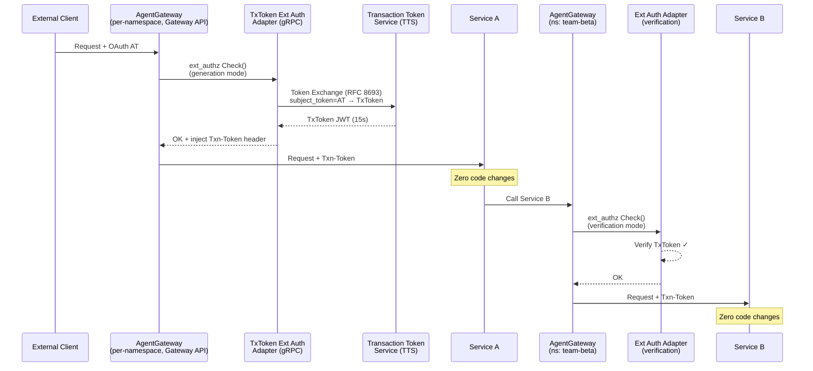
```mermaid
sequenceDiagram
    participant Client as External Client
    participant AGW as AgentGateway<br/>(per-namespace, Gateway API)
    participant ExtAuth as TxToken Ext Auth<br/>Adapter (gRPC)
    participant TTS as Transaction Token<br/>Service (TTS)
    participant SvcA as Service A
    participant AGW2 as AgentGateway<br/>(ns: team-beta)
    participant ExtAuth2 as Ext Auth Adapter<br/>(verification)
    participant SvcB as Service B

    Client->>AGW: Request + OAuth AT
    AGW->>ExtAuth: ext_authz Check()<br/>(generation mode)
    ExtAuth->>TTS: Token Exchange (RFC 8693)<br/>subject_token=AT → TxToken
    TTS-->>ExtAuth: TxToken JWT (15s)
    ExtAuth-->>AGW: OK + inject Txn-Token header
    AGW->>SvcA: Request + Txn-Token
    Note over SvcA: Zero code changes

    SvcA->>AGW2: Call Service B
    AGW2->>ExtAuth2: ext_authz Check()<br/>(verification mode)
    ExtAuth2-->>ExtAuth2: Verify TxToken ✓
    ExtAuth2-->>AGW2: OK
    AGW2->>SvcB: Request + Txn-Token
    Note over SvcB: Zero code changes
```

---

## Reference Architecture — Istio Ambient Mode

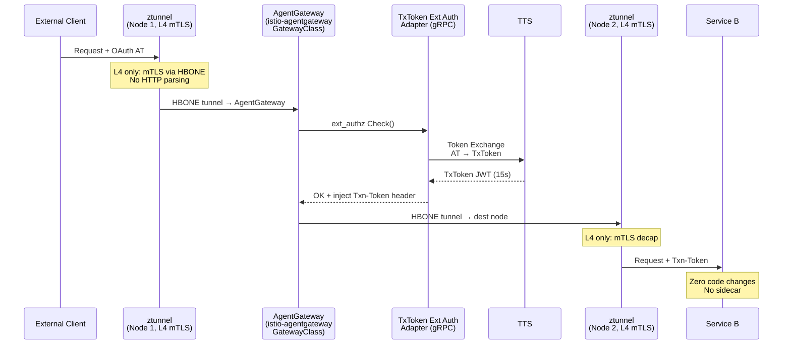
```mermaid
sequenceDiagram
    participant Client as External Client
    participant ZT1 as ztunnel<br/>(Node 1, L4 mTLS)
    participant AGW as AgentGateway<br/>(istio-agentgateway<br/>GatewayClass)
    participant ExtAuth as TxToken Ext Auth<br/>Adapter (gRPC)
    participant TTS as TTS
    participant ZT2 as ztunnel<br/>(Node 2, L4 mTLS)
    participant SvcB as Service B

    Client->>ZT1: Request + OAuth AT
    Note over ZT1: L4 only: mTLS via HBONE<br/>No HTTP parsing
    ZT1->>AGW: HBONE tunnel → AgentGateway
    AGW->>ExtAuth: ext_authz Check()
    ExtAuth->>TTS: Token Exchange<br/>AT → TxToken
    TTS-->>ExtAuth: TxToken JWT (15s)
    ExtAuth-->>AGW: OK + inject Txn-Token header
    AGW->>ZT2: HBONE tunnel → dest node
    Note over ZT2: L4 only: mTLS decap
    ZT2->>SvcB: Request + Txn-Token
    Note over SvcB: Zero code changes<br/>No sidecar
```

---

## Step 1: Minimal TTS — Token Exchange Flow

*TTS internals are data-plane independent — same regardless of ambient, sidecar, or gateway.*

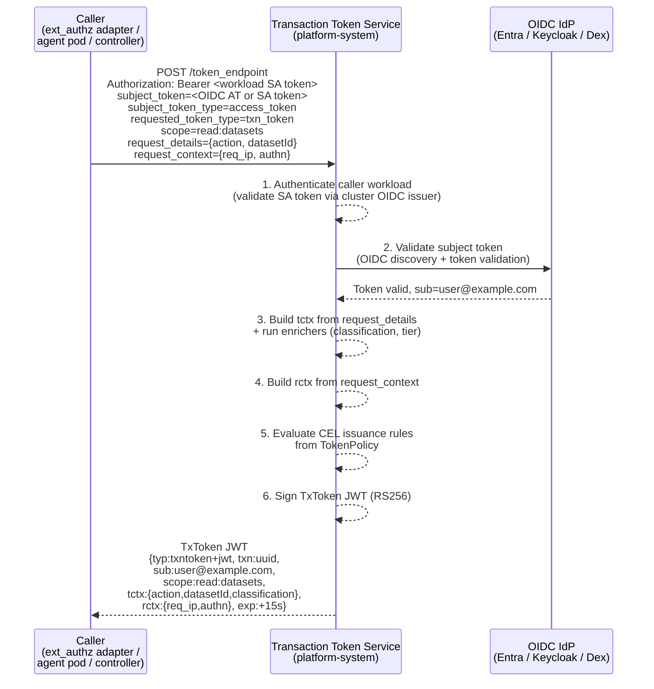
```mermaid
sequenceDiagram
    participant Caller as Caller<br/>(ext_authz adapter /<br/>agent pod / controller)
    participant TTS as Transaction Token Service<br/>(platform-system)
    participant IdP as OIDC IdP<br/>(Entra / Keycloak / Dex)

    Caller->>TTS: POST /token_endpoint<br/>Authorization: Bearer <workload SA token><br/>subject_token=<OIDC AT or SA token><br/>subject_token_type=access_token<br/>requested_token_type=txn_token<br/>scope=read:datasets<br/>request_details={action, datasetId}<br/>request_context={req_ip, authn}

    TTS-->>TTS: 1. Authenticate caller workload<br/>   (validate SA token via cluster OIDC issuer)
    TTS->>IdP: 2. Validate subject token<br/>   (OIDC discovery + token validation)
    IdP-->>TTS: Token valid, sub=user@example.com
    TTS-->>TTS: 3. Build tctx from request_details<br/>   + run enrichers (classification, tier)
    TTS-->>TTS: 4. Build rctx from request_context
    TTS-->>TTS: 5. Evaluate CEL issuance rules<br/>   from TokenPolicy
    TTS-->>TTS: 6. Sign TxToken JWT (RS256)

    TTS-->>Caller: TxToken JWT<br/>{typ:txntoken+jwt, txn:uuid,<br/>sub:user@example.com,<br/>scope:read:datasets,<br/>tctx:{action,datasetId,classification},<br/>rctx:{req_ip,authn}, exp:+15s}
```

### Step 1: Pluggable IdP Validation (KEP-3331 inspired)

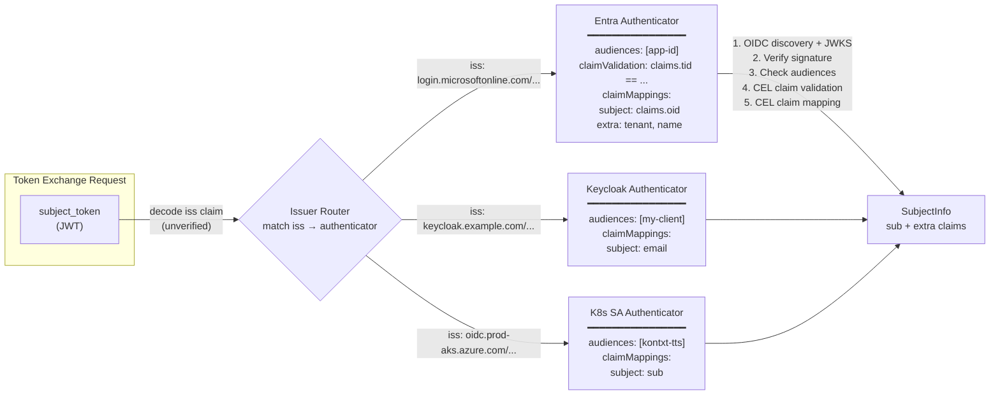
```mermaid
flowchart LR
    subgraph "Token Exchange Request"
        ST["subject_token<br/>(JWT)"]
    end

    ST -->|"decode iss claim<br/>(unverified)"| Router{"Issuer Router<br/>match iss → authenticator"}

    Router -->|"iss: login.microsoftonline.com/..."| Entra["Entra Authenticator<br/>━━━━━━━━━━━━━━━━<br/>audiences: [app-id]<br/>claimValidation: claims.tid == ...<br/>claimMappings:<br/>  subject: claims.oid<br/>  extra: tenant, name"]
    Router -->|"iss: keycloak.example.com/..."| KC["Keycloak Authenticator<br/>━━━━━━━━━━━━━━━━<br/>audiences: [my-client]<br/>claimMappings:<br/>  subject: email"]
    Router -->|"iss: oidc.prod-aks.azure.com/..."| KSAT["K8s SA Authenticator<br/>━━━━━━━━━━━━━━━━<br/>audiences: [kontxt-tts]<br/>claimMappings:<br/>  subject: sub"]

    Entra -->|"1. OIDC discovery + JWKS<br/>2. Verify signature<br/>3. Check audiences<br/>4. CEL claim validation<br/>5. CEL claim mapping"| SubjectInfo["SubjectInfo<br/>sub + extra claims"]
    KC --> SubjectInfo
    KSAT --> SubjectInfo
```

---

## Step 2: Verification + 3-Service Call Chain (via AgentGateway)

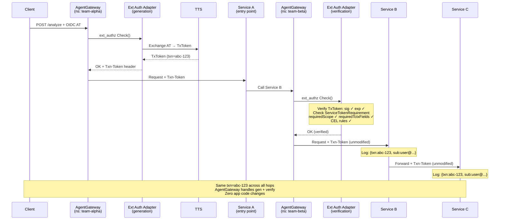
```mermaid
sequenceDiagram
    participant Client as Client
    participant AGW_A as AgentGateway<br/>(ns: team-alpha)
    participant EA_A as Ext Auth Adapter<br/>(generation)
    participant TTS as TTS
    participant A as Service A<br/>(entry point)
    participant AGW_B as AgentGateway<br/>(ns: team-beta)
    participant EA_B as Ext Auth Adapter<br/>(verification)
    participant B as Service B
    participant C as Service C

    Client->>AGW_A: POST /analyze + OIDC AT
    AGW_A->>EA_A: ext_authz Check()
    EA_A->>TTS: Exchange AT → TxToken
    TTS-->>EA_A: TxToken (txn=abc-123)
    EA_A-->>AGW_A: OK + Txn-Token header
    AGW_A->>A: Request + Txn-Token

    A->>AGW_B: Call Service B
    AGW_B->>EA_B: ext_authz Check()
    Note over EA_B: Verify TxToken: sig ✓ exp ✓<br/>Check ServiceTokenRequirement<br/>requiredScope ✓ requiredTctxFields ✓<br/>CEL rules ✓
    EA_B-->>AGW_B: OK (verified)
    AGW_B->>B: Request + Txn-Token (unmodified)
    Note over B: Log: {txn:abc-123, sub:user@...}

    B->>C: Forward + Txn-Token (unmodified)
    Note over C: Log: {txn:abc-123, sub:user@...}

    Note over Client,C: Same txn=abc-123 across all hops<br/>AgentGateway handles gen + verify<br/>Zero app code changes
```

---

## Step 3: Persona-Aligned CRDs + Controller

### CRD Ownership Model

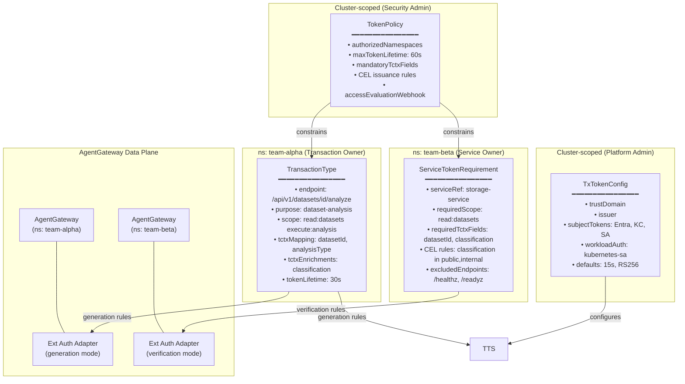
```mermaid
flowchart TB
    subgraph "Cluster-scoped (Security Admin)"
        TP["TokenPolicy<br/>━━━━━━━━━━━━━━━━<br/>• authorizedNamespaces<br/>• maxTokenLifetime: 60s<br/>• mandatoryTctxFields<br/>• CEL issuance rules<br/>• accessEvaluationWebhook"]
    end

    subgraph "Cluster-scoped (Platform Admin)"
        TC["TxTokenConfig<br/>━━━━━━━━━━━━━━━━<br/>• trustDomain<br/>• issuer<br/>• subjectTokens: Entra, KC, SA<br/>• workloadAuth: kubernetes-sa<br/>• defaults: 15s, RS256"]
    end

    subgraph "ns: team-alpha (Transaction Owner)"
        TT["TransactionType<br/>━━━━━━━━━━━━━━━━<br/>• endpoint: /api/v1/datasets/id/analyze<br/>• purpose: dataset-analysis<br/>• scope: read:datasets execute:analysis<br/>• tctxMapping: datasetId, analysisType<br/>• tctxEnrichments: classification<br/>• tokenLifetime: 30s"]
    end

    subgraph "ns: team-beta (Service Owner)"
        STR["ServiceTokenRequirement<br/>━━━━━━━━━━━━━━━━<br/>• serviceRef: storage-service<br/>• requiredScope: read:datasets<br/>• requiredTctxFields: datasetId, classification<br/>• CEL rules: classification in public,internal<br/>• excludedEndpoints: /healthz, /readyz"]
    end

    TP -- "constrains" --> TT
    TP -- "constrains" --> STR
    TC -- "configures" --> TTS["TTS"]
    TT -- "generation rules" --> EA_GEN["Ext Auth Adapter<br/>(generation mode)"]
    TT -- "generation rules" --> TTS
    STR -- "verification rules" --> EA_VER["Ext Auth Adapter<br/>(verification mode)"]

    subgraph "AgentGateway Data Plane"
        AGW_A["AgentGateway<br/>(ns: team-alpha)"] --- EA_GEN
        AGW_B["AgentGateway<br/>(ns: team-beta)"] --- EA_VER
    end
```

### Controller Reconciliation Flow

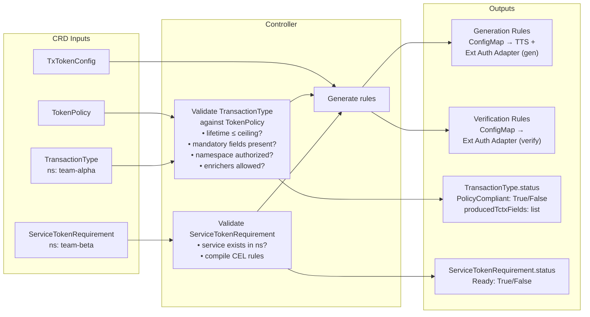
```mermaid
flowchart LR
    subgraph "CRD Inputs"
        TC[TxTokenConfig]
        TP[TokenPolicy]
        TT["TransactionType<br/>ns: team-alpha"]
        STR["ServiceTokenRequirement<br/>ns: team-beta"]
    end

    subgraph "Controller"
        direction TB
        V1["Validate TransactionType<br/>against TokenPolicy<br/>• lifetime ≤ ceiling?<br/>• mandatory fields present?<br/>• namespace authorized?<br/>• enrichers allowed?"]
        V2["Validate ServiceTokenRequirement<br/>• service exists in ns?<br/>• compile CEL rules"]
        V3[Generate rules]
    end

    subgraph "Outputs"
        GR["Generation Rules<br/>ConfigMap → TTS +<br/>Ext Auth Adapter (gen)"]
        VR["Verification Rules<br/>ConfigMap →<br/>Ext Auth Adapter (verify)"]
        S1["TransactionType.status<br/>PolicyCompliant: True/False<br/>producedTctxFields: list"]
        S2["ServiceTokenRequirement.status<br/>Ready: True/False"]
    end

    TC --> V3
    TP --> V1
    TT --> V1
    V1 --> V3
    STR --> V2
    V2 --> V3
    V3 --> GR
    V3 --> VR
    V1 --> S1
    V2 --> S2
```

---

## Step 4: AgentGateway + Ext Auth — Transparent TxToken Enforcement

### How AgentGateway Replaces Sidecars

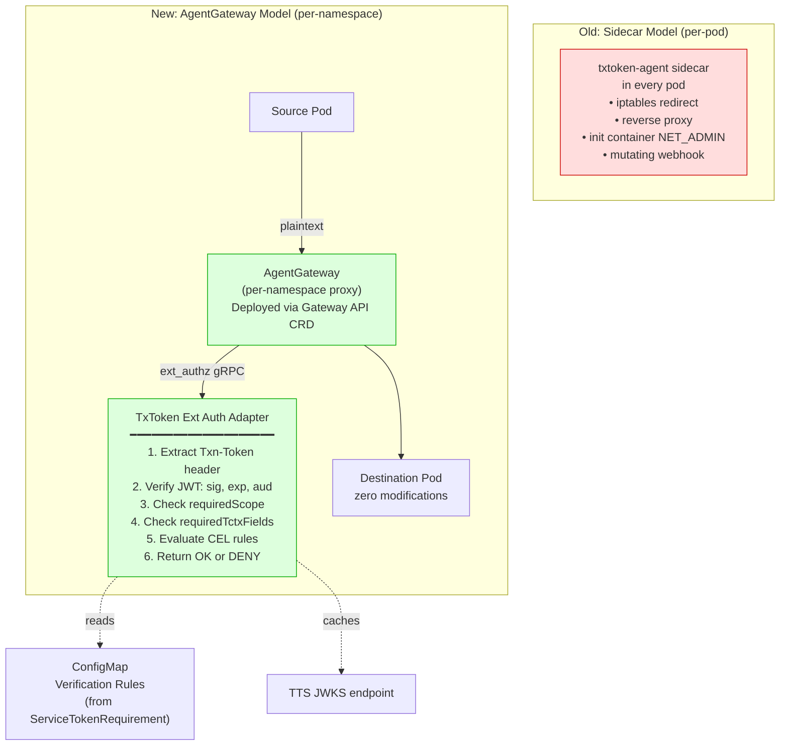
```mermaid
flowchart TB
    subgraph "Old: Sidecar Model (per-pod)"
        OLD_SC["txtoken-agent sidecar<br/>in every pod<br/>• iptables redirect<br/>• reverse proxy<br/>• init container NET_ADMIN<br/>• mutating webhook"]
    end

    subgraph "New: AgentGateway Model (per-namespace)"
        SRC[Source Pod] -->|"plaintext"| AGW["AgentGateway<br/>(per-namespace proxy)<br/>Deployed via Gateway API CRD"]
        AGW -->|"ext_authz gRPC"| EA["TxToken Ext Auth Adapter<br/>━━━━━━━━━━━━━━━━━━━━<br/>1. Extract Txn-Token header<br/>2. Verify JWT: sig, exp, aud<br/>3. Check requiredScope<br/>4. Check requiredTctxFields<br/>5. Evaluate CEL rules<br/>6. Return OK or DENY"]
        AGW --> DST[Destination Pod<br/>zero modifications]
    end

    EA -.->|"reads"| CM["ConfigMap<br/>Verification Rules<br/>(from ServiceTokenRequirement)"]
    EA -.->|"caches"| JWKS["TTS JWKS endpoint"]

    style OLD_SC fill:#fdd,stroke:#c00
    style AGW fill:#dfd,stroke:#0a0
    style EA fill:#dfd,stroke:#0a0
```

### Deployment: Standalone vs Istio-Managed

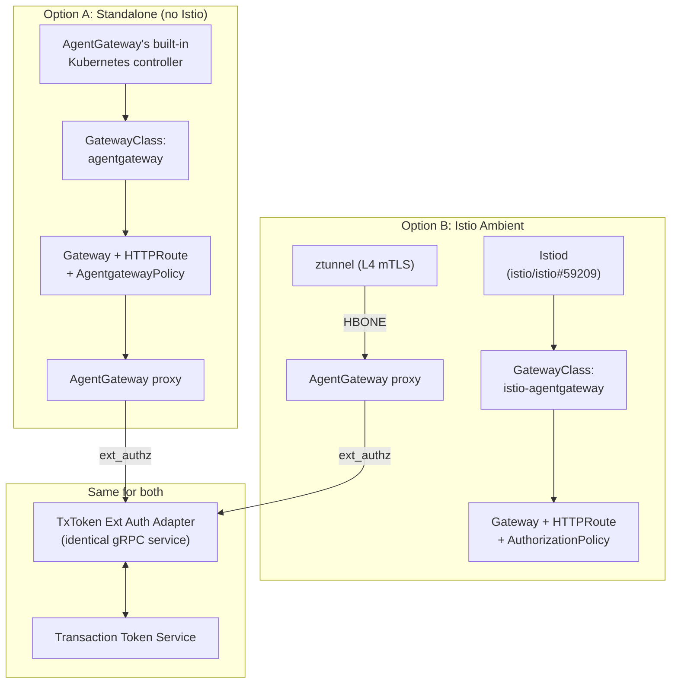
```mermaid
flowchart TB
    subgraph "Option A: Standalone (no Istio)"
        CP_A["AgentGateway's built-in<br/>Kubernetes controller"]
        GC_A["GatewayClass:<br/>agentgateway"]
        GW_A["Gateway + HTTPRoute<br/>+ AgentgatewayPolicy"]
        AGW_A["AgentGateway proxy"]
        CP_A --> GC_A --> GW_A --> AGW_A
    end

    subgraph "Option B: Istio Ambient"
        CP_B["Istiod<br/>(istio/istio#59209)"]
        GC_B["GatewayClass:<br/>istio-agentgateway"]
        GW_B["Gateway + HTTPRoute<br/>+ AuthorizationPolicy"]
        ZT["ztunnel (L4 mTLS)"]
        AGW_B["AgentGateway proxy"]
        CP_B --> GC_B --> GW_B
        ZT -->|"HBONE"| AGW_B
    end

    subgraph "Same for both"
        EA["TxToken Ext Auth Adapter<br/>(identical gRPC service)"]
        TTS["Transaction Token Service"]
    end

    AGW_A -->|"ext_authz"| EA
    AGW_B -->|"ext_authz"| EA
    EA <--> TTS
```

### AgentGateway Enrollment (no webhook, no sidecar injection)

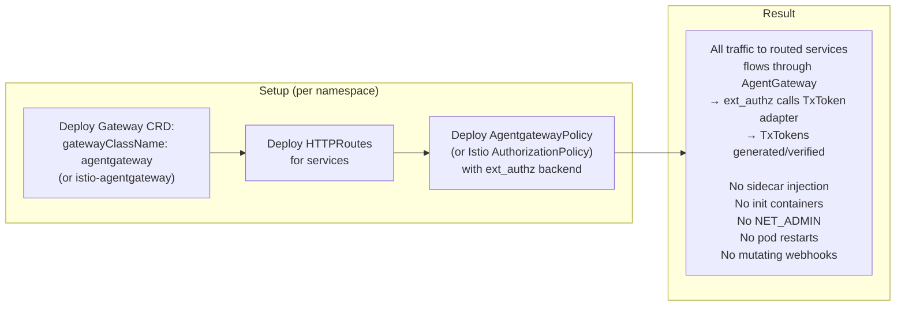
```mermaid
flowchart LR
    subgraph "Setup (per namespace)"
        GW["Deploy Gateway CRD:<br/>gatewayClassName: agentgateway<br/>(or istio-agentgateway)"]
        ROUTE["Deploy HTTPRoutes<br/>for services"]
        POLICY["Deploy AgentgatewayPolicy<br/>(or Istio AuthorizationPolicy)<br/>with ext_authz backend"]
    end

    subgraph "Result"
        R["All traffic to routed services<br/>flows through AgentGateway<br/>→ ext_authz calls TxToken adapter<br/>→ TxTokens generated/verified<br/><br/>No sidecar injection<br/>No init containers<br/>No NET_ADMIN<br/>No pod restarts<br/>No mutating webhooks"]
    end

    GW --> ROUTE --> POLICY --> R
```

### Ext Auth Adapter Verification Detail

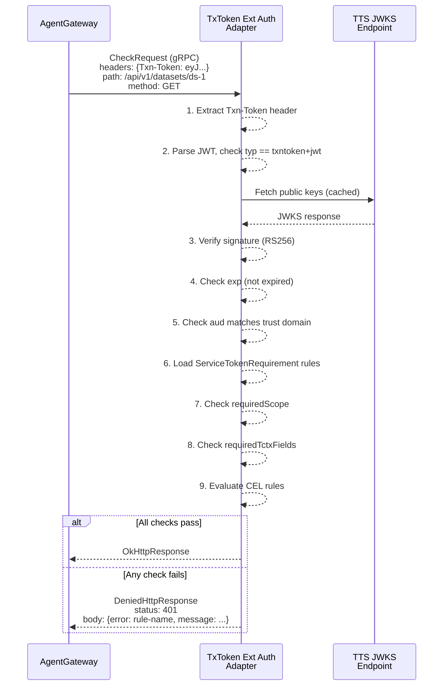
```mermaid
sequenceDiagram
    participant AGW as AgentGateway
    participant EA as TxToken Ext Auth<br/>Adapter
    participant JWKS as TTS JWKS<br/>Endpoint

    AGW->>EA: CheckRequest (gRPC)<br/>headers: {Txn-Token: eyJ...}<br/>path: /api/v1/datasets/ds-1<br/>method: GET

    EA-->>EA: 1. Extract Txn-Token header
    EA-->>EA: 2. Parse JWT, check typ == txntoken+jwt
    EA->>JWKS: Fetch public keys (cached)
    JWKS-->>EA: JWKS response
    EA-->>EA: 3. Verify signature (RS256)
    EA-->>EA: 4. Check exp (not expired)
    EA-->>EA: 5. Check aud matches trust domain
    EA-->>EA: 6. Load ServiceTokenRequirement rules
    EA-->>EA: 7. Check requiredScope
    EA-->>EA: 8. Check requiredTctxFields
    EA-->>EA: 9. Evaluate CEL rules

    alt All checks pass
        EA-->>AGW: OkHttpResponse
    else Any check fails
        EA-->>AGW: DeniedHttpResponse<br/>status: 401<br/>body: {error: rule-name, message: ...}
    end
```

---

## Step 5: Internal Workload Identity Resolution

### Internal Workload — All Traffic Through AgentGateway

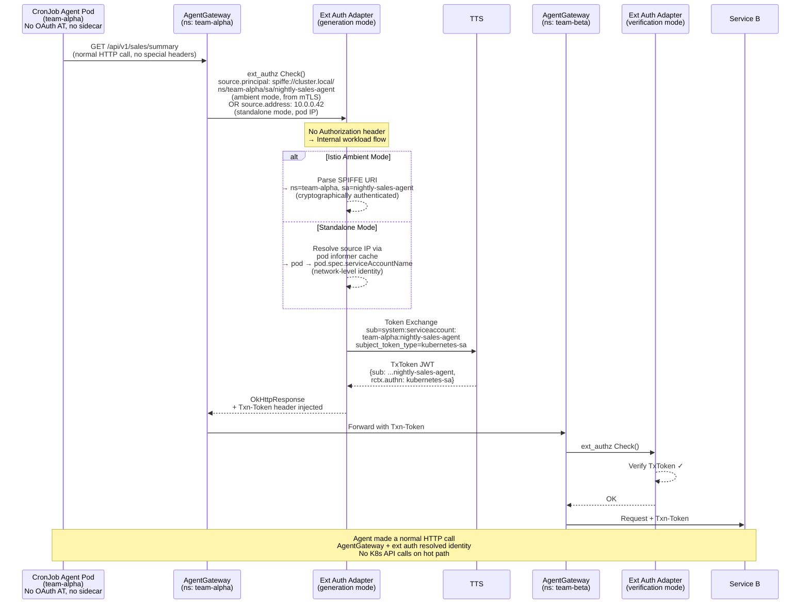
```mermaid
sequenceDiagram
    participant Agent as CronJob Agent Pod<br/>(team-alpha)<br/>No OAuth AT, no sidecar
    participant AGW as AgentGateway<br/>(ns: team-alpha)
    participant EA as Ext Auth Adapter<br/>(generation mode)
    participant TTS as TTS
    participant AGW2 as AgentGateway<br/>(ns: team-beta)
    participant EA2 as Ext Auth Adapter<br/>(verification mode)
    participant Svc as Service B

    Agent->>AGW: GET /api/v1/sales/summary<br/>(normal HTTP call, no special headers)
    AGW->>EA: ext_authz Check()<br/>source.principal: spiffe://cluster.local/<br/>  ns/team-alpha/sa/nightly-sales-agent<br/>(ambient mode, from mTLS)<br/>OR source.address: 10.0.0.42<br/>(standalone mode, pod IP)

    Note over EA: No Authorization header<br/>→ Internal workload flow

    alt Istio Ambient Mode
        EA-->>EA: Parse SPIFFE URI<br/>→ ns=team-alpha, sa=nightly-sales-agent<br/>(cryptographically authenticated)
    else Standalone Mode
        EA-->>EA: Resolve source IP via<br/>pod informer cache<br/>→ pod → pod.spec.serviceAccountName<br/>(network-level identity)
    end

    EA->>TTS: Token Exchange<br/>sub=system:serviceaccount:<br/>  team-alpha:nightly-sales-agent<br/>subject_token_type=kubernetes-sa
    TTS-->>EA: TxToken JWT<br/>{sub: ...nightly-sales-agent,<br/>rctx.authn: kubernetes-sa}

    EA-->>AGW: OkHttpResponse<br/>+ Txn-Token header injected

    AGW->>AGW2: Forward with Txn-Token
    AGW2->>EA2: ext_authz Check()
    EA2-->>EA2: Verify TxToken ✓
    EA2-->>AGW2: OK
    AGW2->>Svc: Request + Txn-Token

    Note over Agent,Svc: Agent made a normal HTTP call<br/>AgentGateway + ext auth resolved identity<br/>No K8s API calls on hot path
```

### Controller Orchestrating Multi-Agent Workflow

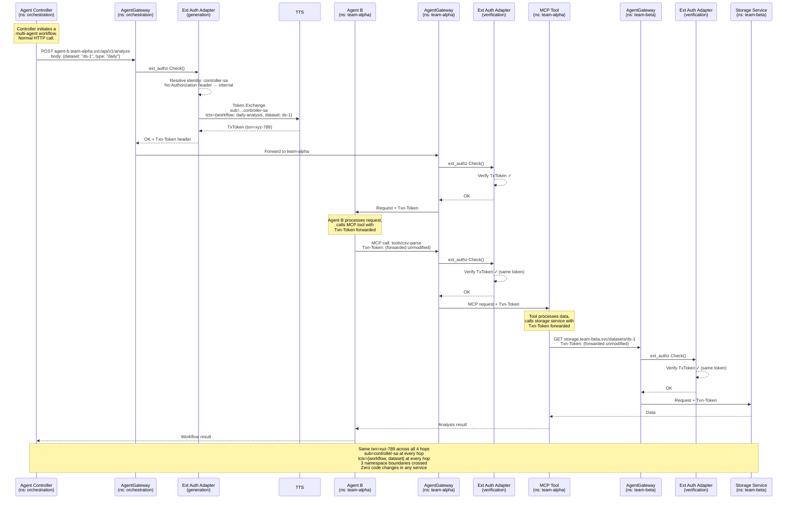
```mermaid
sequenceDiagram
    participant Ctrl as Agent Controller<br/>(ns: orchestration)
    participant AGW1 as AgentGateway<br/>(ns: orchestration)
    participant EA1 as Ext Auth Adapter<br/>(generation)
    participant TTS as TTS
    participant AgentB as Agent B<br/>(ns: team-alpha)
    participant AGW2 as AgentGateway<br/>(ns: team-alpha)
    participant EA2 as Ext Auth Adapter<br/>(verification)
    participant Tool as MCP Tool<br/>(ns: team-alpha)
    participant AGW3 as AgentGateway<br/>(ns: team-beta)
    participant EA3 as Ext Auth Adapter<br/>(verification)
    participant Store as Storage Service<br/>(ns: team-beta)

    Note over Ctrl: Controller initiates a<br/>multi-agent workflow.<br/>Normal HTTP call.

    Ctrl->>AGW1: POST agent-b.team-alpha.svc/api/v1/analyze<br/>body: {dataset: "ds-1", type: "daily"}
    AGW1->>EA1: ext_authz Check()
    EA1-->>EA1: Resolve identity: controller-sa<br/>No Authorization header → internal
    EA1->>TTS: Token Exchange<br/>sub=...controller-sa<br/>tctx={workflow: daily-analysis, dataset: ds-1}
    TTS-->>EA1: TxToken (txn=xyz-789)
    EA1-->>AGW1: OK + Txn-Token header

    AGW1->>AGW2: Forward to team-alpha
    AGW2->>EA2: ext_authz Check()
    EA2-->>EA2: Verify TxToken ✓
    EA2-->>AGW2: OK
    AGW2->>AgentB: Request + Txn-Token

    Note over AgentB: Agent B processes request,<br/>calls MCP tool with<br/>Txn-Token forwarded

    AgentB->>AGW2: MCP call: tools/csv-parse<br/>Txn-Token: (forwarded unmodified)
    AGW2->>EA2: ext_authz Check()
    EA2-->>EA2: Verify TxToken ✓ (same token)
    EA2-->>AGW2: OK
    AGW2->>Tool: MCP request + Txn-Token

    Note over Tool: Tool processes data,<br/>calls storage service with<br/>Txn-Token forwarded

    Tool->>AGW3: GET storage.team-beta.svc/datasets/ds-1<br/>Txn-Token: (forwarded unmodified)
    AGW3->>EA3: ext_authz Check()
    EA3-->>EA3: Verify TxToken ✓ (same token)
    EA3-->>AGW3: OK
    AGW3->>Store: Request + Txn-Token

    Store-->>Tool: Data
    Tool-->>AgentB: Analysis result
    AgentB-->>Ctrl: Workflow result

    Note over Ctrl,Store: Same txn=xyz-789 across all 4 hops<br/>sub=controller-sa at every hop<br/>tctx={workflow, dataset} at every hop<br/>3 namespace boundaries crossed<br/>Zero code changes in any service
```

---

## Step 6: Scope Narrowing + CEL Policy

### Token Replacement via AgentGateway (autoNarrow)

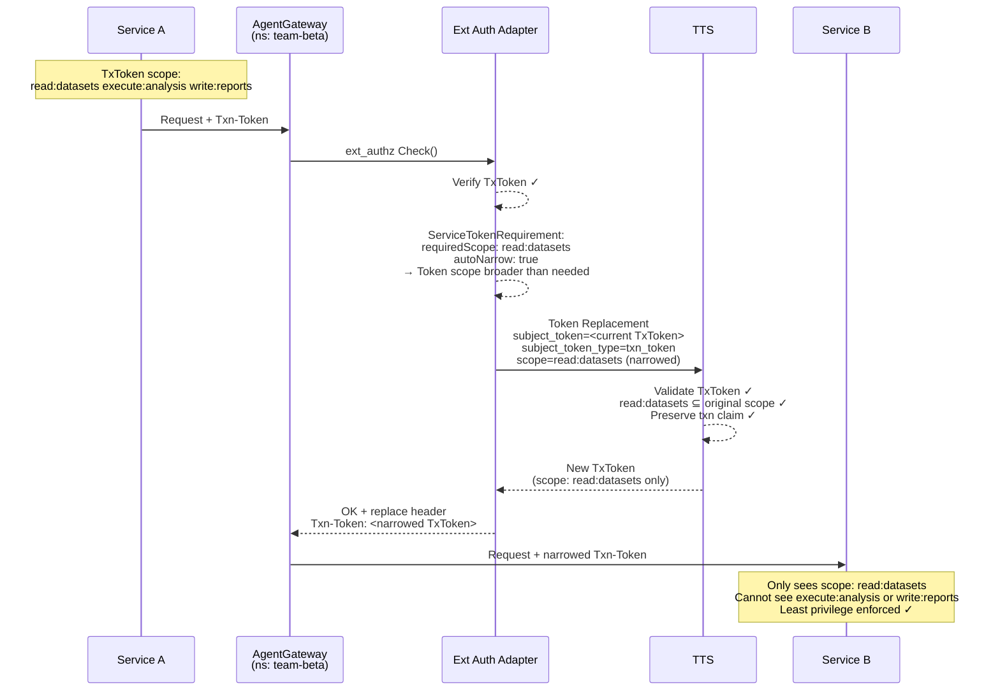
```mermaid
sequenceDiagram
    participant A as Service A
    participant AGW as AgentGateway<br/>(ns: team-beta)
    participant EA as Ext Auth Adapter
    participant TTS as TTS
    participant B as Service B

    Note over A: TxToken scope:<br/>read:datasets execute:analysis write:reports

    A->>AGW: Request + Txn-Token
    AGW->>EA: ext_authz Check()
    EA-->>EA: Verify TxToken ✓
    EA-->>EA: ServiceTokenRequirement:<br/>requiredScope: read:datasets<br/>autoNarrow: true<br/>→ Token scope broader than needed

    EA->>TTS: Token Replacement<br/>subject_token=<current TxToken><br/>subject_token_type=txn_token<br/>scope=read:datasets (narrowed)

    TTS-->>TTS: Validate TxToken ✓<br/>read:datasets ⊆ original scope ✓<br/>Preserve txn claim ✓
    TTS-->>EA: New TxToken<br/>(scope: read:datasets only)

    EA-->>AGW: OK + replace header<br/>Txn-Token: <narrowed TxToken>
    AGW->>B: Request + narrowed Txn-Token

    Note over B: Only sees scope: read:datasets<br/>Cannot see execute:analysis or write:reports<br/>Least privilege enforced ✓
```

### CEL Issuance Policy Evaluation (at TTS)

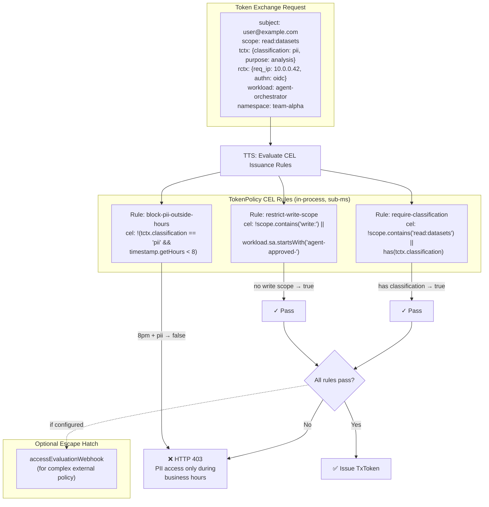
```mermaid
flowchart TB
    subgraph "Token Exchange Request"
        REQ["subject: user@example.com<br/>scope: read:datasets<br/>tctx: {classification: pii, purpose: analysis}<br/>rctx: {req_ip: 10.0.0.42, authn: oidc}<br/>workload: agent-orchestrator<br/>namespace: team-alpha"]
    end

    REQ --> TTS[TTS: Evaluate CEL Issuance Rules]

    subgraph "TokenPolicy CEL Rules (in-process, sub-ms)"
        R1["Rule: block-pii-outside-hours<br/>cel: !(tctx.classification == 'pii' &&<br/>  timestamp.getHours < 8)"]
        R2["Rule: restrict-write-scope<br/>cel: !scope.contains('write:') ||<br/>  workload.sa.startsWith('agent-approved-')"]
        R3["Rule: require-classification<br/>cel: !scope.contains('read:datasets') ||<br/>  has(tctx.classification)"]
    end

    TTS --> R1
    TTS --> R2
    TTS --> R3

    R1 -->|"8pm + pii → false"| DENY["❌ HTTP 403<br/>PII access only during<br/>business hours"]
    R2 -->|"no write scope → true"| PASS2[✓ Pass]
    R3 -->|"has classification → true"| PASS3[✓ Pass]

    PASS2 --> ALLPASS{All rules pass?}
    PASS3 --> ALLPASS
    ALLPASS -->|"Yes"| ISSUE["✅ Issue TxToken"]
    ALLPASS -->|"No"| DENY

    subgraph "Optional Escape Hatch"
        WH["accessEvaluationWebhook<br/>(for complex external policy)"]
    end
    ALLPASS -.->|"if configured"| WH
```

### CEL Verification at AgentGateway Ext Auth

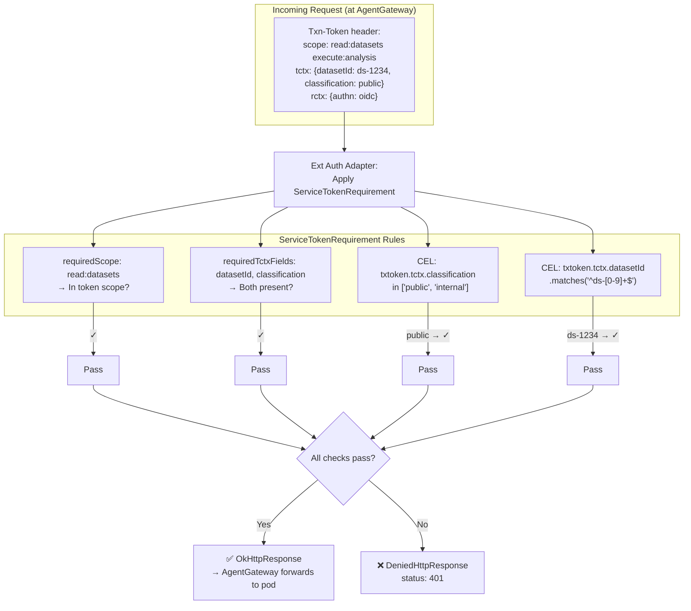
```mermaid
flowchart TB
    subgraph "Incoming Request (at AgentGateway)"
        TXT["Txn-Token header:<br/>scope: read:datasets execute:analysis<br/>tctx: {datasetId: ds-1234, classification: public}<br/>rctx: {authn: oidc}"]
    end

    TXT --> EA["Ext Auth Adapter:<br/>Apply ServiceTokenRequirement"]

    subgraph "ServiceTokenRequirement Rules"
        CHK1["requiredScope: read:datasets<br/>→ In token scope?"]
        CHK2["requiredTctxFields: datasetId, classification<br/>→ Both present?"]
        CEL1["CEL: txtoken.tctx.classification<br/>  in ['public', 'internal']"]
        CEL2["CEL: txtoken.tctx.datasetId<br/>  .matches('^ds-[0-9]+$')"]
    end

    EA --> CHK1
    EA --> CHK2
    EA --> CEL1
    EA --> CEL2

    CHK1 -->|"✓"| P1[Pass]
    CHK2 -->|"✓"| P2[Pass]
    CEL1 -->|"public → ✓"| P3[Pass]
    CEL2 -->|"ds-1234 → ✓"| P4[Pass]

    P1 --> ALL{All checks pass?}
    P2 --> ALL
    P3 --> ALL
    P4 --> ALL

    ALL -->|"Yes"| FWD["✅ OkHttpResponse<br/>→ AgentGateway forwards to pod"]
    ALL -->|"No"| REJ["❌ DeniedHttpResponse<br/>status: 401"]
```

---

## Overall System Architecture (AgentGateway)

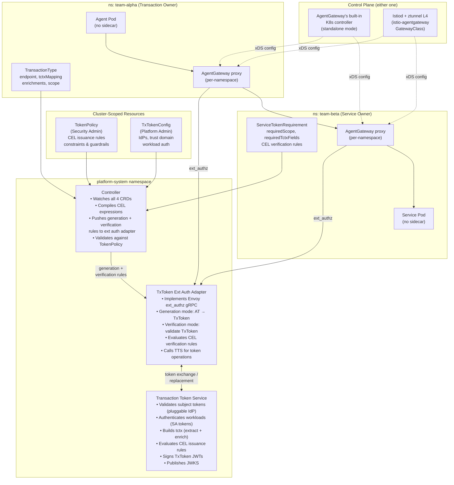
```mermaid
flowchart TB
    subgraph "Cluster-Scoped Resources"
        TP["TokenPolicy<br/>(Security Admin)<br/>CEL issuance rules<br/>constraints & guardrails"]
        TC["TxTokenConfig<br/>(Platform Admin)<br/>IdPs, trust domain<br/>workload auth"]
    end

    subgraph "platform-system namespace"
        TTS["Transaction Token Service<br/>• Validates subject tokens (pluggable IdP)<br/>• Authenticates workloads (SA tokens)<br/>• Builds tctx (extract + enrich)<br/>• Evaluates CEL issuance rules<br/>• Signs TxToken JWTs<br/>• Publishes JWKS"]
        CTRL["Controller<br/>• Watches all 4 CRDs<br/>• Compiles CEL expressions<br/>• Pushes generation + verification<br/>  rules to ext auth adapter<br/>• Validates against TokenPolicy"]
        EA["TxToken Ext Auth Adapter<br/>• Implements Envoy ext_authz gRPC<br/>• Generation mode: AT → TxToken<br/>• Verification mode: validate TxToken<br/>• Evaluates CEL verification rules<br/>• Calls TTS for token operations"]
    end

    subgraph "Control Plane (either one)"
        CP_STANDALONE["AgentGateway's built-in<br/>K8s controller<br/>(standalone mode)"]
        CP_ISTIO["Istiod + ztunnel L4<br/>(istio-agentgateway<br/>GatewayClass)"]
    end

    subgraph "ns: team-alpha (Transaction Owner)"
        TT["TransactionType<br/>endpoint, tctxMapping<br/>enrichments, scope"]
        AGW_A["AgentGateway proxy<br/>(per-namespace)"]
        AGENT["Agent Pod<br/>(no sidecar)"]
    end

    subgraph "ns: team-beta (Service Owner)"
        STR["ServiceTokenRequirement<br/>requiredScope, requiredTctxFields<br/>CEL verification rules"]
        AGW_B["AgentGateway proxy<br/>(per-namespace)"]
        SVC["Service Pod<br/>(no sidecar)"]
    end

    TP --> CTRL
    TC --> CTRL
    TT --> CTRL
    STR --> CTRL

    CTRL -->|"generation +<br/>verification rules"| EA
    EA <-->|"token exchange /<br/>replacement"| TTS

    CP_STANDALONE -.->|"xDS config"| AGW_A
    CP_STANDALONE -.->|"xDS config"| AGW_B
    CP_ISTIO -.->|"xDS config"| AGW_A
    CP_ISTIO -.->|"xDS config"| AGW_B

    AGENT --> AGW_A
    AGW_A -->|"ext_authz"| EA
    AGW_A --> AGW_B
    AGW_B -->|"ext_authz"| EA
    AGW_B --> SVC
```

---

## Production: Deployment Models

*The TTS, CRDs, controller, and ext auth adapter are the constants. Only the control plane and L4 layer change.*

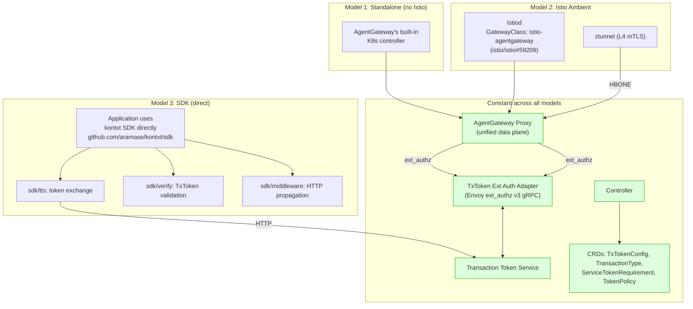
```mermaid
flowchart TB
    subgraph "Constant across all models"
        TTS["Transaction Token Service"]
        EA["TxToken Ext Auth Adapter<br/>(Envoy ext_authz v3 gRPC)"]
        CRDs["CRDs: TxTokenConfig, TransactionType,<br/>ServiceTokenRequirement, TokenPolicy"]
        CTRL["Controller"]
        AGW_PROXY["AgentGateway Proxy<br/>(unified data plane)"]
    end

    subgraph "Model 1: Standalone (no Istio)"
        CP1["AgentGateway's built-in<br/>K8s controller"] --> AGW_PROXY
        AGW_PROXY -->|"ext_authz"| EA
    end

    subgraph "Model 2: Istio Ambient"
        CP2["Istiod<br/>GatewayClass: istio-agentgateway<br/>(istio/istio#59209)"] --> AGW_PROXY
        ZT2["ztunnel (L4 mTLS)"] -->|"HBONE"| AGW_PROXY
        AGW_PROXY -->|"ext_authz"| EA
    end

    subgraph "Model 3: SDK (direct)"
        APP["Application uses<br/>kontxt SDK directly<br/>github.com/aramase/kontxt/sdk"]
        APP_TTS["sdk/tts: token exchange"]
        APP_VER["sdk/verify: TxToken validation"]
        APP_MW["sdk/middleware: HTTP propagation"]
        APP --> APP_TTS
        APP --> APP_VER
        APP --> APP_MW
        APP_TTS -->|"HTTP"| TTS
    end

    CTRL --> CRDs
    EA <--> TTS

    style TTS fill:#dfd,stroke:#0a0
    style EA fill:#dfd,stroke:#0a0
    style CRDs fill:#dfd,stroke:#0a0
    style CTRL fill:#dfd,stroke:#0a0
    style AGW_PROXY fill:#dfd,stroke:#0a0
```
